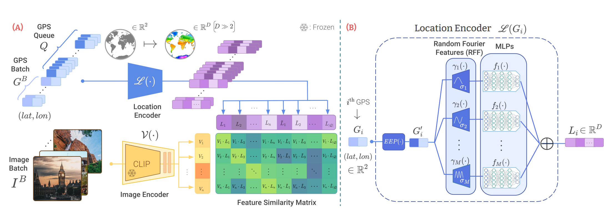
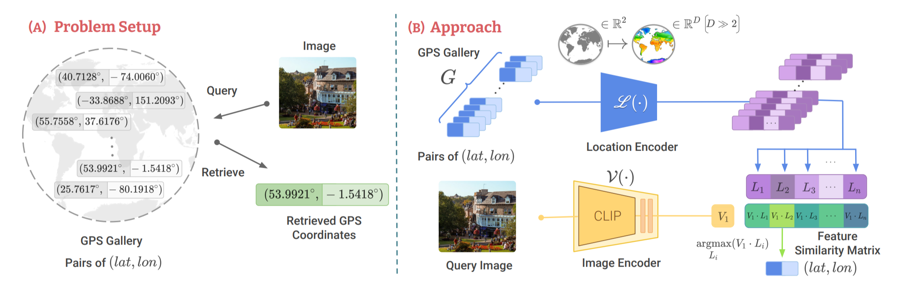

# 🌍 GeoCLIP - OSINT Dashboard & Worldwide Geo-localization



Questo repository è un fork operativo del progetto accademico originale [GeoCLIP](https://github.com/VicenteVivan/geo-clip). Il motore neurale di base è stato mantenuto intatto, ma è stato incapsulato in una **Dashboard OSINT** progettata per indagini reali. 

L'obiettivo è smettere di guardare solo le percentuali statistiche dell'IA da un terminale e iniziare a incrociarle con testi, loghi e metadati estratti dall'immagine per ottenere conferme visive e contestuali.

---

## 🧠 Il Motore Originale (Come funziona GeoCLIP)

*Dalla documentazione originale dell'autore:*
GeoCLIP affronta la sfida della geolocalizzazione globale delle immagini introducendo un approccio ispirato a CLIP che allinea immagini e posizioni geografiche. Il *location encoder* modella la Terra come una funzione continua, apprendendo feature semanticamente ricche e adatte alla geolocalizzazione.

Simile al modello CLIP di OpenAI, GeoCLIP è addestrato in modo contrastivo abbinando coppie Immagine-GPS. Utilizzando il dataset MP-16, composto da 4.7 milioni di immagini scattate in tutto il mondo, GeoCLIP apprende le caratteristiche visive distintive associate ai diversi luoghi del pianeta.



---

## ⚡ L'Evoluzione: OSINT Dashboard (v3.0)

La teoria statistica incontra l'intelligence visiva. Questo fork chiude il cerchio dell'analisi automatizzando i controlli incrociati:

* **GUI Gradio:** Interfaccia dark-mode professionale. Trascini la foto e parte l'analisi. Nessuna riga di comando necessaria.
* **Mappe Interattive (Folium):** I 5 migliori risultati stimati dall'IA vengono piazzati su una mappa interattiva (CartoDB Dark Matter) per darti immediatamente il contesto geografico.
* **Scanner EXIF:** Se la foto non è stata piallata dalle compressioni dei social network, il tool estrae i metadati originali (coordinate GPS, marca e modello del dispositivo, data di scatto).
* **Motore OCR (EasyOCR):** Legge in automatico cartelli stradali, insegne e scritte nell'immagine. Se GeoCLIP piazza il pin in Germania e l'OCR estrae la parola "Apotheke", hai una conferma solida sulla zona linguistica.

---

## 🔮 Roadmap & Future Implementazioni

Le reti neurali visive da sole sono cieche se non c'è una logica a collegare i dati. Ecco cosa verrà integrato per chiudere la pipeline di intelligence:

* **Object Detection (YOLOv8):** Riconoscimento di elementi chiave per la geolocalizzazione (es. semafori specifici, targhe, vegetazione endemica, segnaletica stradale).
* **LLM Reasoning:** Integrazione API di un modello linguistico che analizzi l'output combinato (GeoCLIP + OCR + YOLO) e formuli una deduzione logica finale (es. *"L'IA dice Europa, l'OCR legge tedesco, YOLO rileva un tram giallo. -> Berlino, Germania"*).
* **Reverse Image Search:** Script integrato per lanciare in automatico i ritagli dell'immagine su motori come Yandex o Google Lens.
* **Cronolocalizzazione:** Calcolo grezzo di ora solare e orientamento incrociando l'angolazione delle ombre con la data EXIF.

---

## ⚙️ Installazione

Requisiti: Python 3.8+. L'uso di un ambiente virtuale (`venv`) è obbligatorio per non creare conflitti con le librerie di sistema.

```bash
# 1. Clona il fork
git clone [https://github.com/Marchy02/Geo-clip-gui.git](https://github.com/Marchy02/Geo-clip-gui.git)
cd Geo-clip-gui

# 2. Crea e attiva il venv
python -m venv venv
source venv/bin/activate  # Su Linux/Mac
# venv\Scripts\activate   # Su Windows

# 3. Collega il motore IA (Editable mode)
pip install -e .

# 4. Installa le librerie della dashboard
pip install -r requirements.txt
```

---

## 🚀 Come si usa

A `venv` attivo, lancia semplicemente lo script dalla radice del progetto:

```bash
python geoclip_gui.py
```

Il terminale avvierà il server locale (solitamente `http://127.0.0.1:7860`). Aprilo nel browser, carica l'immagine e avvia la pipeline.

*Nota: Al primissimo avvio, Python scaricherà in automatico da HuggingFace i pesi di GeoCLIP e i modelli linguistici di EasyOCR. L'operazione richiederà qualche minuto a seconda della connessione.*

---

## 📜 Crediti Originali

Tutto il motore neurale alla base di questo strumento è **GeoCLIP**. Se utilizzi questo repository per paper o scopi di ricerca accademica, sei tenuto a citare i creatori originali del modello:

```bibtex
@inproceedings{geoclip,
  title={GeoCLIP: Clip-Inspired Alignment between Locations and Images for Effective Worldwide Geo-localization},
  author={Vivanco, Vicente and Nayak, Gaurav Kumar and Shah, Mubarak},
  booktitle={Advances in Neural Information Processing Systems},
  year={2023}
}
```